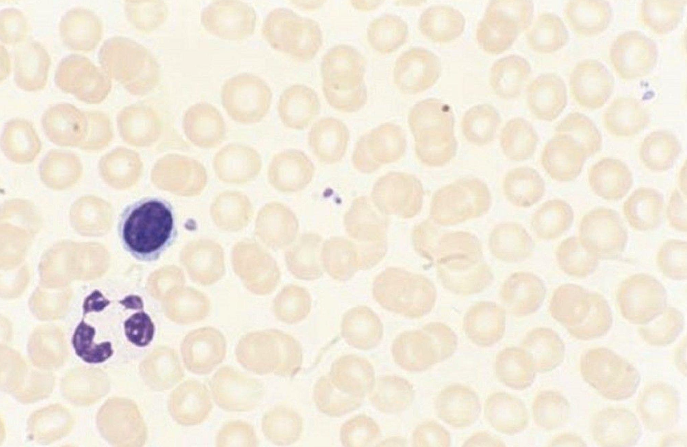
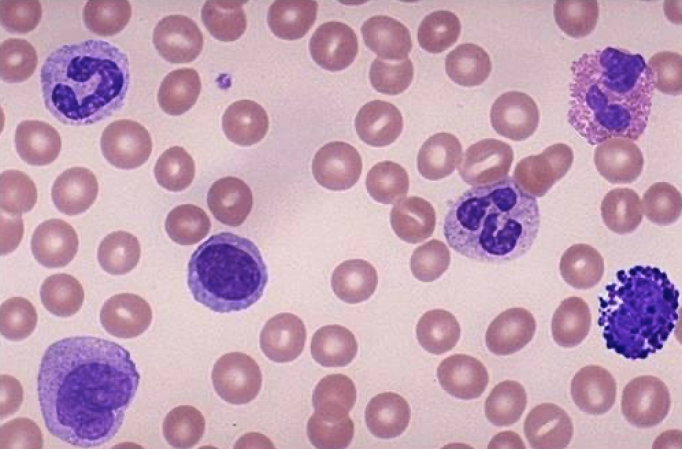
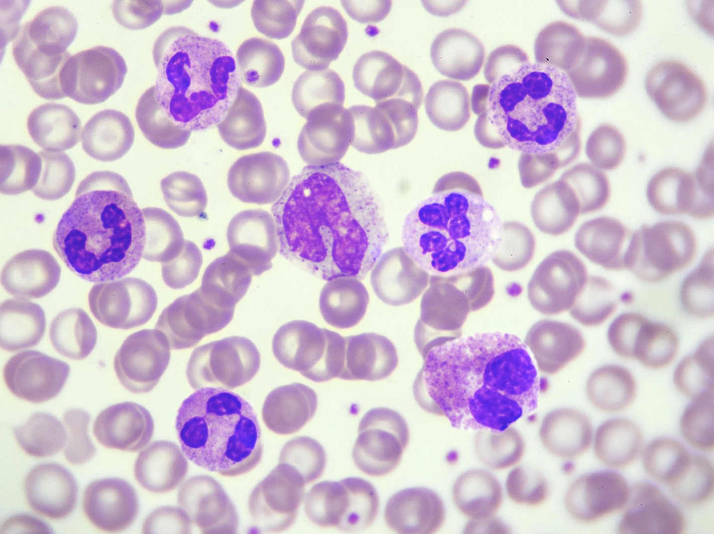

<p align="center">
  
</p>


# 🔬 citoVision

> Plataforma modular de análisis microscópico asistido por IA. El TFM desarrolla su primer módulo: un sistema de cribado morfológico hematológico que detecta, segmenta y clasifica automáticamente células para priorizar la revisión profesional.

> ⚠️ **Estado del proyecto:** MVP en desarrollo.

---

# Descripción

citoVision es un proyecto desarrollado como TFM cuyo objetivo es demostrar cómo la Inteligencia Artificial puede utilizarse como herramienta de apoyo en tareas del ámbito sanitario, sin sustituir el criterio del profesional.

La aplicación analiza imágenes microscópicas de muestras sanguíneas para:

- Imagen microscópica

- Segmentación y detección de células

- Clasificación morfológica de células

- Conteo por clase

- Marcado de células potencialmente relevantes

- Informe visual y estadístico


El proyecto está concebido como un MVP (Minimum Viable Product), priorizando un alcance realista y técnicamente sólido.

---

# Objetivos

## Objetivo principal

Desarrollar una aplicación multiplataforma basada en IA capaz de asistir al profesional sanitario durante el análisis microscópico de muestras sanguíneas.

## Objetivos específicos

- Detectar automáticamente células en imágenes microscópicas.
- Contabilizar las células detectadas.
- Clasificar cada célula utilizando un modelo de IA entrenado mediante Transfer Learning.
- Mostrar el resultado de forma visual e intuitiva.
- Almacenar análisis asociados a pacientes mediante Firebase.


<p align="center">
  
  
  
</p>

---

# Alcance del MVP

## Funcionalidades

- Splash Screen
- Login
    - Usuario y contraseña
    - Google Sign-In
    - Modo invitado
- Navegación inferior mediante tres pestañas
- Análisis de imágenes
- Conteo celular
- Clasificación celular
- Historial de análisis
- Consulta de análisis por paciente
- Ajustes de la aplicación

---

# Arquitectura

El proyecto se desarrollará utilizando **Kotlin Multiplatform (KMP)**.

Plataformas previstas:

| Plataforma | Estado |
|------------|--------|
| Android | ✅ Obligatoria |
| Desktop | 🚧 Deseable |
| iOS | 🔄 Opcional |

La lógica de negocio se compartirá mediante KMP, mientras que la inferencia del modelo IA dispondrá de implementaciones específicas para cada plataforma cuando sea necesario.

---

# Tecnologías

## Desarrollo

- Kotlin
- Kotlin Multiplatform
- Jetpack Compose
- Compose Multiplatform
- Android Studio

## Inteligencia Artificial

- Python
- Ultralytics YOLO
- Transfer Learning (Fine-Tuning)
- TensorFlow Lite (Android)

## Backend

- Firebase Authentication
- Firebase Firestore
- Firebase Storage

## Entrenamiento

- Google Colab

---

# Flujo del análisis

```text
Imagen microscópica
        │
        ▼
Detección de células
        │
        ▼
Conteo
        │
        ▼
Clasificación
        │
        ▼
Resultados
        │
        ▼
Guardado del análisis
```

---

# Flujo de usuario

```text
Splash

↓

Login

↓

Pantalla Principal

├── Análisis
├── Historial
└── Pacientes
```

---

# Modelo de IA

citoVision **no entrena un modelo desde cero**.

Se utilizará un modelo preentrenado basado en YOLO que será especializado mediante **Transfer Learning (Fine-Tuning)** utilizando datasets públicos.

Datasets previstos:

- BBBC
- Raabin-WBC

---

# Filosofía del proyecto

citoVision **no pretende diagnosticar enfermedades**.

El objetivo es ofrecer una herramienta de apoyo a las tareas durante el análisis microscópico.

La decisión clínica seguirá correspondiendo siempre al profesional sanitario.

---

# Estado actual

- [x] Definición del proyecto
- [x] Definición del MVP
- [x] Arquitectura inicial
- [x] Configuración del proyecto KMP
- [ ] Entrenamiento del modelo IA
- [ ] Integración IA
- [ ] Firebase
- [ ] Versión Android
- [ ] Versión Desktop
- [ ] Documentación

---

# Licencia

Pendiente de definir.
