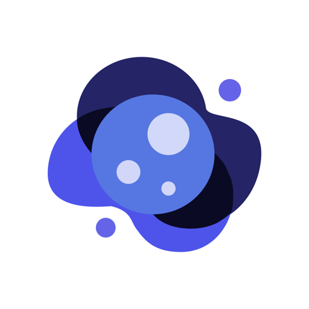
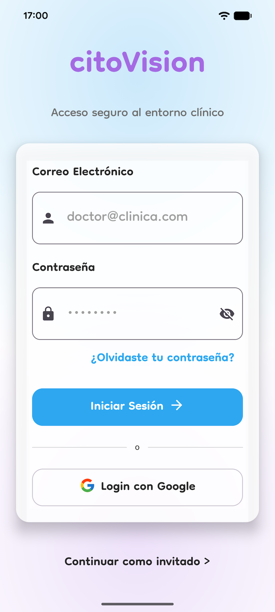
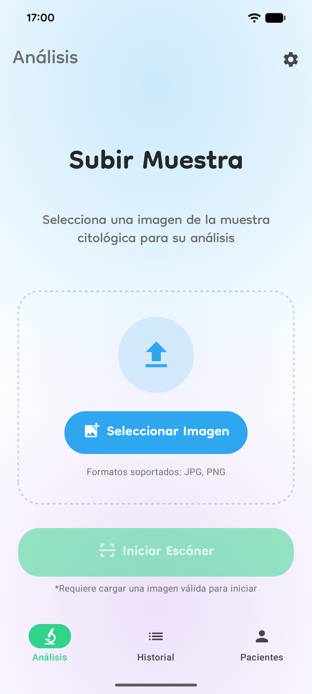
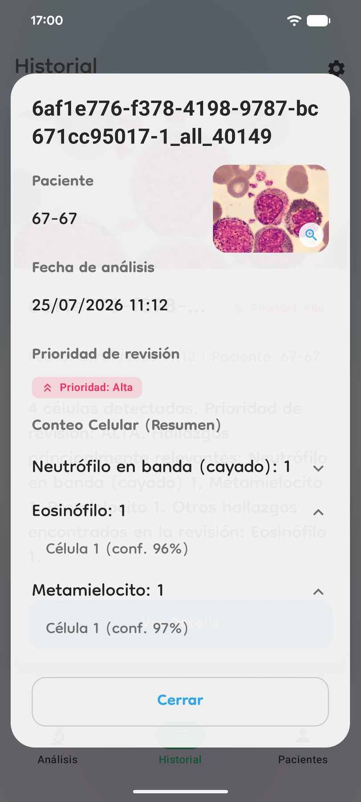
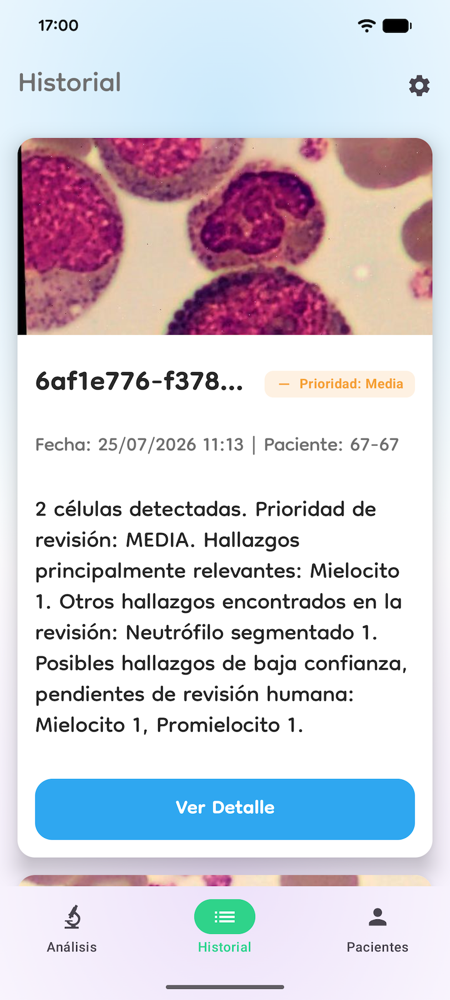
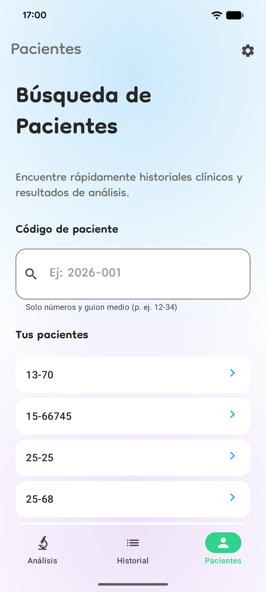
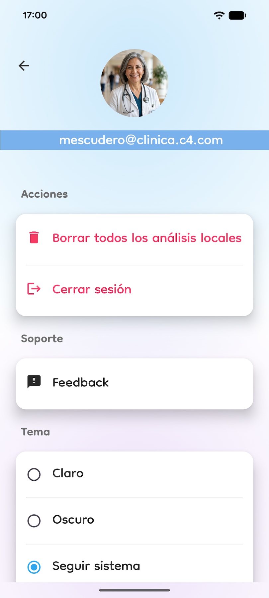
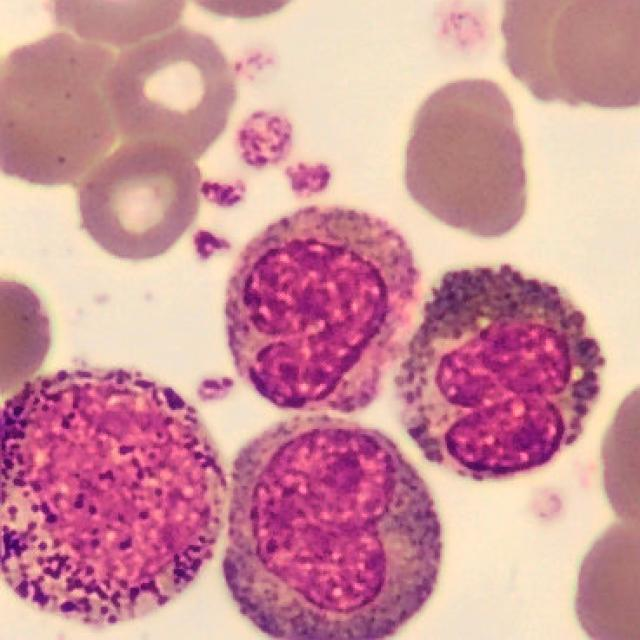
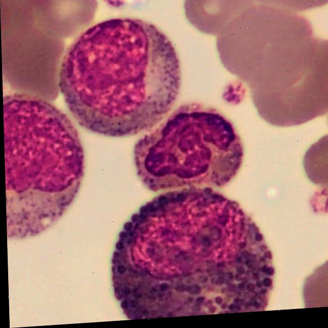
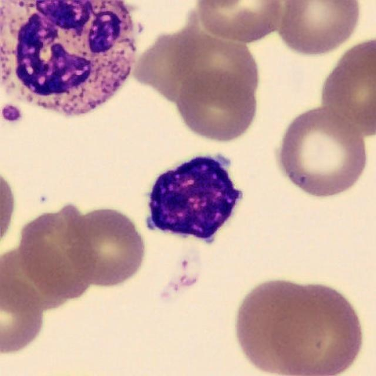

<p align="center">
  
</p>

<h1 align="center">🔬 citoVision</h1>

<p align="center">
  <em>Cribado morfológico hematológico asistido por IA: detecta, segmenta y clasifica células
  sanguíneas para <strong>priorizar</strong> la revisión del profesional.</em>
</p>

<p align="center">
  
  
  
  
  
  
</p>

---

## Tabla de contenidos

- [¿Qué es citoVision?](#qué-es-citovision)
- [Qué necesidad cubre](#qué-necesidad-cubre)
- [Capturas](#capturas)
- [Funcionalidades](#funcionalidades)
- [Arquitectura](#arquitectura)
- [Tecnologías](#tecnologías)
- [Descargar citoVision](#Descargar-citoVision)
- [Para probar citoVision](#Para-probar-citoVision)
- [El modelo de IA](#el-modelo-de-ia)
- [Datos: local y remoto](#datos-local-y-remoto)
- [Seguridad y privacidad](#seguridad-y-privacidad)
- [Flujos](#flujos)
- [Cómo compilar](#cómo-compilar)
- [Testing](#testing)
- [Desarrollo dirigido por especificaciones](#desarrollo-dirigido-por-especificaciones)
- [Estado del proyecto](#estado-del-proyecto)
- [Licencia y atribución](#licencia-y-atribución)

---

## ¿Qué es citoVision?

**citoVision** es una aplicación multiplataforma (Android y macOS) que analiza imágenes microscópicas de
frotis sanguíneo y, sobre cada muestra, **detecta y clasifica las células**, las **cuenta por tipo** y
calcula una **prioridad de revisión** según los hallazgos morfológicos encontrados. La inferencia se
ejecuta **en el propio dispositivo** (on-device), sin enviar la imagen a ningún servidor para analizarla.

Es el Trabajo Fin de Máster que desarrolla el **primer módulo** de una plataforma modular de análisis
microscópico asistido por IA. Está concebido como un **MVP** (producto mínimo viable) con un alcance
realista y técnicamente sólido.

> ⚠️ **citoVision no diagnostica.** Es un prototipo académico y experimental, no está clínicamente validado
> y no es un producto sanitario. Su función es **priorizar** qué muestras conviene revisar antes; la
> decisión clínica corresponde siempre al profesional.

**[Video: Un recorrido por citoVision](https://drive.google.com/file/d/12zMgc6C16O8i1xfBK5qQKEIHlPTzvPyQ/view?usp=sharing)**

## Qué necesidad cubre

La revisión morfológica de un frotis al microscopio es **manual, lenta y dependiente de la experiencia**
del observador. Cuando el volumen de muestras es alto, los casos que requieren atención urgente (por
ejemplo, la presencia de células inmaduras) pueden quedar en una cola indiferenciada.

citoVision aborda ese cuello de botella **ordenando la cola**: marca automáticamente las muestras con
hallazgos morfológicamente relevantes para que el profesional **empiece por lo importante**. No reemplaza
el criterio experto; reduce el tiempo hasta que ese criterio se aplica donde más importa.

## Capturas


<p align="center">
  
  
  
</p>
<p align="center">
  
  
  
</p>

## Funcionalidades

- **Splash** e identidad visual propia.
- **Acceso**: correo y contraseña, Google Sign-In (Android) y **modo invitado** local. Las cuentas **no se
  crean desde la aplicación**: las genera **Lovelaced**, desarrolladora de citoVision, a petición.
- **Navegación inferior** con tres pestañas: Análisis, Historial y Pacientes.
- **Análisis de una muestra**: selección de imagen, **inferencia on-device**, conteo y clasificación por
  tipo celular, y **badge de prioridad** (baja / media / alta) con aviso no diagnóstico.
- **Confianza por célula**: en el detalle, la confianza del modelo para cada célula detectada.
- **Historial local** de análisis con visor de imagen a pantalla completa.
- **Consulta por paciente**: listado filtrable de los códigos de paciente del usuario y sus análisis
  almacenados en la nube.
- **Ajustes**: identidad de la cuenta, tema claro/oscuro/sistema, envío de feedback, borrado de datos
  locales, información de licencia y atribuciones.

> 👤 **Acceso con cuenta.** Por seguridad, el registro está cerrado: los usuarios **no pueden crearse desde
> la aplicación**. Es **Lovelaced**, desarrolladora de citoVision, quien genera las cuentas a petición. Sin
> cuenta puedes usar la app en **modo invitado** (análisis e historial locales). Si te interesa probar
> citoVision con cuenta de usuario, escríbenos a **[citovision.mvp@gmail.com](mailto:citovision.mvp@gmail.com)**


## Arquitectura

Proyecto **Kotlin Multiplatform (KMP)** con la lógica compartida en el módulo `shared/`, siguiendo
**Clean Architecture + MVVM**. La lógica común vive primero en `commonMain`; solo se recurre a código
específico de plataforma cuando hay una dependencia real (SDK de Android, APIs de escritorio, motor de
inferencia nativo…).

```
shared/
├── presentation   → UI (Compose Multiplatform), ViewModels, estado y eventos
├── application    → casos de uso y puertos (contratos)
├── domain         → entidades, reglas de negocio, validaciones
├── infrastructure → implementaciones: red (Ktor), persistencia (Room), Firebase REST, inferencia (ONNX)
├── composition    → inyección de dependencias (Koin)
├── core / ui      → utilidades transversales y sistema de tema
```

| Plataforma | Estado en el MVP |
|------------|------------------|
| Android    | ✅ Soportada (APK/AAB firmados) |
| macOS (Desktop / JVM) | ✅ Soportada (DMG) |
| iOS        | ⏸️ Fuera del MVP |
| Windows / Linux | ⏸️ Fuera del MVP |

## Tecnologías

| Ámbito | Stack |
|--------|-------|
| Lenguaje / UI | Kotlin · Kotlin Multiplatform · Compose Multiplatform 1.10 · Material 3 |
| Inyección de dependencias | Koin 4.0 |
| Red | Ktor Client 3.0 · kotlinx.serialization |
| Persistencia local | Room 2.8 (Multiplatform) · DataStore |
| Imágenes | Coil 3 |
| Logging | Napier |
| IA (inferencia) | ONNX Runtime 1.22 (on-device, Android + Desktop) |
| IA (entrenamiento) | Python · Ultralytics YOLO11 · Transfer Learning (fine-tuning) |
| Backend | Firebase Authentication · Cloud Firestore · Firebase Storage (vía API REST) |
| Cobertura de tests | Kover |

<p align="center">
  
  
  
</p>


## Descargar citoVision

| Plataforma | Cómo se obtiene | Requisito mínimo |
|---|---|---|
| **Android** (APK) | ➡️ **[citoVision 1.0.0-beta](https://drive.google.com/file/d/1Q2V4EaN68BrStUah4szb8TzaS1VN6eNi/view?usp=sharing)** | Android 8.1 (API 27) |
| **macOS** (DMG) | ➡️ El mismo enlace: ambos van en el ZIP | macOS |
| **iOS** | ➡️ Invitación de **TestFlight** · _enlace pendiente de la primera build_ | iPhone con iOS 18.6 |

> ⚠️ **En Android y macOS, lee antes las instrucciones de instalación adjuntadas al ZIP.**
>
> Al ser una app fuera de la App Store y Google Play, el sistema puede mostrar un aviso de seguridad la primera
> vez; las instrucciones explican cómo abrirla con normalidad en cada plataforma.

> ℹ️ **Por qué iOS se reparte de otra forma.** Android y macOS permiten instalar software fuera de su tienda;
> iOS no: un iPhone solo ejecuta aplicaciones firmadas por un perfil que lo autorice, así que no existe un
> equivalente al APK suelto. La versión de iOS se distribuye por **TestFlight**, el canal de betas de Apple:
> se instala la app TestFlight y se acepta la invitación, sin necesidad de Mac ni de Xcode. El razonamiento
> completo y las alternativas descartadas están en
> [ADR-0010](docs/adr/0010-distribucion-ios-testflight.md).


## Para probar citoVision

Para probar las funciones de detección, conteo, clasificación y priorización de CitoVision, puedes descargar una selección de imágenes microscópicas de muestra desde el siguiente enlace:

➡️  [**Muestras para probar la aplicación CitoVision**](https://drive.google.com/file/d/1OjNSxrATrKuYkSkE31K0ogvtN6eKJwrJ/view?usp=sharing)

> Estas imágenes se proporcionan exclusivamente con fines académicos y de demostración. Los resultados obtenidos no constituyen un diagnóstico clínico.

## El modelo de IA

citoVision **no entrena desde cero**: parte de **YOLO11s-seg** y lo especializa mediante **Transfer
Learning (fine-tuning)** sobre el **UNIVALI Leukocyte Dataset**, reorganizado con un **reparto
estratificado** por clase. En la aplicación se ejecuta exportado a **ONNX** y corriendo **on-device** con
ONNX Runtime; se usa la rama de detección del modelo (las máscaras de segmentación no se explotan en el MVP).

El modelo reconoce **14 clases** (12 tipos celulares + 2 no celulares). Cada tipo aporta un **peso de
relevancia morfológica**: cuanto mayor es la presencia de células inmaduras o atípicas, mayor es la
prioridad de revisión asignada a la muestra.

| Clase | ¿Célula? | Relevancia |
|-------|:-------:|:----------:|
| Blasto | ✅ | ●●●●● |
| Promielocito | ✅ | ●●●● |
| Mielocito | ✅ | ●●● |
| Metamielocito | ✅ | ●●● |
| Linfocito atípico | ✅ | ●● |
| Basófilo | ✅ | ●● |
| Eritroblasto | ✅ | ●● |
| Neutrófilo en banda (cayado) | ✅ | ● |
| Linfocito | ✅ | — |
| Monocito | ✅ | — |
| Eosinófilo | ✅ | — |
| Neutrófilo segmentado | ✅ | — |
| Artefacto | ❌ | — |
| Restos celulares | ❌ | — |

Las cinco clases más críticas (blasto, promielocito, mielocito, metamielocito y linfocito atípico) se
evalúan con un **umbral de confianza rebajado** para no perder hallazgos débiles, que se presentan de forma
diferenciada y con un efecto **acotado** sobre la prioridad (nunca elevan por sí solos una muestra a
prioridad alta).

> 📄 **Informe de entrenamiento del modelo:** [entrenamiento del modelo](/external/INFORME_TECNICO_ENTRENAMIENTO_MODELO_CITOVISION.md)


## Datos: local y remoto

citoVision maneja **dos almacenes independientes**, por diseño:

- **Muestras locales** (Room): cada análisis realizado se guarda en el dispositivo (imagen, conteo,
  prioridad, fecha) y se muestra en el **Historial**. Funciona también en **modo invitado**, sin cuenta.
- **Análisis por paciente** (Firestore + Storage): con la sesión de una cuenta iniciada, los análisis se
  **sincronizan a la nube** asociados a un **código de paciente** seudonimizado. La pestaña **Pacientes**
  consulta ese almacén remoto, acotado a los datos del propio usuario.

Ambos son independientes: borrar una muestra del Historial local no afecta al análisis remoto, y viceversa.
La sincronización a la nube es **asíncrona y duradera** (patrón *outbox*): la muestra local se guarda al
instante y el envío remoto se reintenta hasta completarse.

## Seguridad y privacidad

- **Autorización en el servidor.** Las reglas de Firestore y Storage exigen sesión autenticada y **acotan
  cada dato a su propietario** (`ownerUid`); no es una restricción solo de interfaz.
- **ID token en cada petición.** Las llamadas REST a Firebase viajan con el token del usuario; el cliente
  sin credenciales queda reservado al inicio de sesión.
- **Inferencia on-device.** La imagen se analiza en el dispositivo; no se envía a un servicio externo para
  su análisis.
- **Sin secretos en el repositorio.** Las claves de configuración se aportan por build (`local.properties`
  / variables de entorno), fuera del control de versiones.

## Flujos

**Análisis de una muestra**

```
Imagen microscópica → Detección → Conteo → Clasificación → Prioridad → Resultado → Guardado (local + nube)
```

**Navegación**

```
Splash → Login → Pantalla principal
                 ├── Análisis
                 ├── Historial
                 └── Pacientes
```

## Cómo compilar

**Requisitos**

- JDK 17
- Android Studio (versión reciente) o el SDK de Android con `compileSdk 36`
- Para el empaquetado de macOS, un JDK con `jpackage` disponible
- Para iOS, un Mac con Xcode reciente

**Configuración local**

Crea un fichero `local.properties` en la raíz (no versionado) con, al menos:

```properties
sdk.dir=/ruta/al/Android/sdk
firebaseWebApiKey=TU_WEB_API_KEY   # Web API key de Firebase (pública, sin restricción de aplicación)
```

Para el login con Google en Android se necesita además el `google-services.json` del proyecto Firebase y,
para las builds de release firmadas, un `keystore.properties` propio (ambos fuera del repositorio).

**Comandos habituales**

```bash
# Comprobaciones y tests de la lógica compartida
./gradlew ktlintCheck :shared:allTests

# Android (debug)
./gradlew :androidApp:assembleDebug

# Desktop (ejecutar en local)
./gradlew :desktopApp:run

# Desktop (empaquetar DMG de macOS)
./gradlew :desktopApp:packageDmg
```

**iOS** no se compila con Gradle: se abre `iosApp/iosApp.xcodeproj` en Xcode y se ejecuta desde ahí. El
framework `shared` lo genera el propio proyecto mediante una fase de compilación que invoca
`:shared:embedAndSignAppleFrameworkForXcode`, así que no hay que construirlo por separado. Para ejecutar
en un iPhone físico hace falta indicar el `TEAM_ID` en `iosApp/Configuration/Config.xcconfig`; en el
simulador puede quedarse vacío.

> Requisitos mínimos de ejecución: **Android 8.1 (API 27)** o superior · **iOS 18.6** o superior ·
> **macOS** (paquete DMG).

## Testing

El proyecto sigue una pirámide de test con el grueso en **tests unitarios** de dominio, casos de uso y
ViewModels, más tests de integración de repositorios y fuentes de datos (con `MockEngine` de Ktor y dobles
de persistencia). La cobertura se mide con **Kover**:

```bash
./gradlew :shared:koverLog          # resumen por consola
./gradlew :shared:koverHtmlReport   # informe navegable en shared/build/reports/kover/html/
```

La cobertura se valora **por capas**: la lógica de negocio y de presentación (dominio, casos de uso,
ViewModels) está ampliamente cubierta, mientras que la UI declarativa (Compose) no se cubre con tests
unitarios, como es habitual en este tipo de proyectos.

## Desarrollo dirigido por especificaciones

citoVision se ha construido con un enfoque **spec-driven**: cada funcionalidad partió de una
**especificación aprobada** antes de escribir código, y las decisiones técnicas relevantes quedaron
registradas como **ADR** (Architecture Decision Records) y **RFC**. Esta documentación vive en el propio
repositorio y es la fuente de verdad del proyecto — este README se ha redactado a partir de ella:

- `docs/specs/` — especificaciones funcionales (autenticación, imagen, historial, base remota, inferencia…)
- `docs/adr/` — decisiones de arquitectura (Firestore REST, auth Desktop, inferencia ONNX…)
- `docs/rfc/` — propuestas técnicas
- `AGENTS.md`, `ARCHITECTURE.md`, `DESIGN.md`, `RULES.md`, `TESTING.md`, `SECURITY_MOBILE.md` — normas
  transversales del proyecto

## Estado del proyecto

- [x] Definición del proyecto y del MVP
- [x] Arquitectura y configuración KMP
- [x] Autenticación (Firebase / Identity Toolkit REST)
- [x] Análisis de imagen e **inferencia on-device (ONNX)**
- [x] Modelo entrenado y validado para el MVP
- [x] Historial local (Room) y análisis por paciente (Firestore + Storage)
- [x] Reglas de seguridad cerradas (autorización en servidor)
- [x] Tema claro/oscuro y pulido de UI
- [x] Entregables firmados: **APK + AAB** (Android) y **DMG** (macOS)
- [x] Cobertura de tests con Kover
- [x] Soporte de iOS
- [ ] Distribución de iOS por TestFlight - __03/09/2026 Work in progress__
- [ ] Soporte Windows
- [ ] Selección de bloques de imágenes
- [x] Selección de imágenes de ubicaciones externas
- [x] Documentación final del TFM

## Licencia y atribución

Desarrollado por **Lovelaced** — Sergio Álvarez.

**citoVision** — Copyright © 2026 Sergio Álvarez. Todos los derechos reservados.

Software **propietario**. Es un prototipo académico y experimental: no está clínicamente validado, no es un
producto sanitario y no debe utilizarse para emitir diagnósticos ni sustituir el criterio de profesionales
sanitarios. Para cualquier uso, reutilización o modificación del código, contacta con el autor.

**Atribución del dataset** — citoVision utiliza el **UNIVALI Leukocyte Dataset**, disponible en
[Zenodo](https://zenodo.org/records/17743609) bajo licencia **Creative Commons Attribution 4.0 International
(CC BY 4.0)**. El conjunto de datos se reorganizó mediante un reparto estratificado y se empleó para ajustar
un modelo de segmentación. Los autores del dataset no respaldan ni certifican citoVision.
